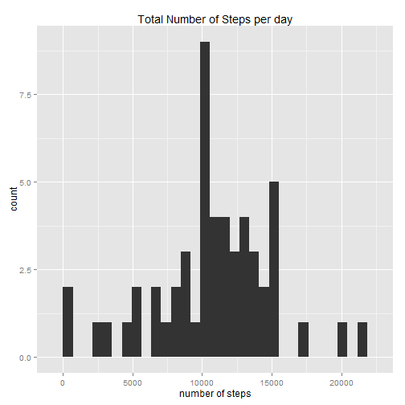
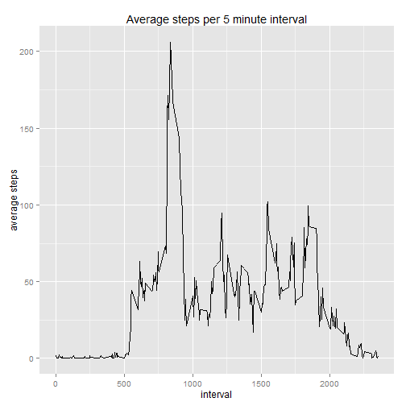
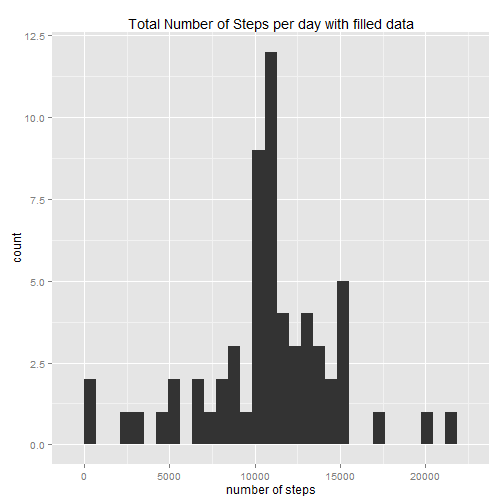
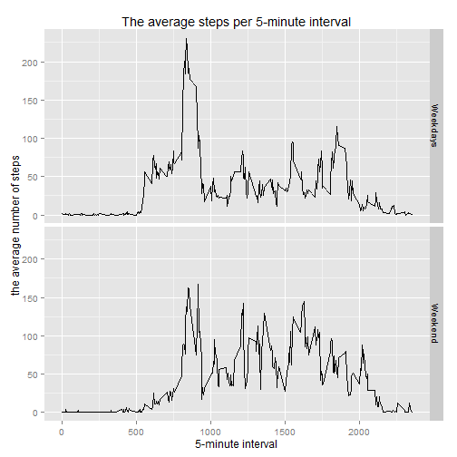

# Project 1 of the Reproducible Research


## Loading and preprocessing the data

```r
unzip("activity.zip")
activity <- read.csv("activity.csv")
activity$date <- as.Date(activity$date)
```


## What is mean total number of steps taken per day?

1. Make a histogram of the total number of steps taken each day

```r
library(ggplot2)
```

```
## Warning: package 'ggplot2' was built under R version 3.2.1
```

```r
days <- aggregate(steps~date, activity, sum, na.rm=TRUE)
qplot(steps, data=days)+labs(title="Total Number of Steps per day", x="number of steps")
```

```
## stat_bin: binwidth defaulted to range/30. Use 'binwidth = x' to adjust this.
```

 

2. Calculate and report the **mean** and **median** total number of steps taken per day


```r
mean_NA <- mean(days$steps)
median_NA <- median(days$steps)
```
The **mean** is 1.0766189 &times; 10<sup>4</sup> and the **median** is 10765.


## What is the average daily activity pattern?

1. The time series plot of the 5-minute interval and the average number of steps taken, averaged across all days


```r
# Calculate the average steps according to interval
interval <- aggregate(steps~interval, activity, mean)

ggplot(interval, aes(x=interval, y=steps))+geom_line()+labs(title="Average steps per 5 minute interval", y="average steps")
```

 

2. Interval which contains the maximum number of steps

```r
interval$interval[which.max(interval$steps)]
```

```
## [1] 835
```


## Imputing missing values

1. The total number of missing values in the dataset

```r
sum(is.na(activity$steps))
```

```
## [1] 2304
```

2. Create a new dataset with the missing data filled in

-Strategy : Filling NAs with the mean value for that interval


```r
activity_fill <- activity
    for (i in 1:17568){
                if (is.na(activity_fill$steps[i])){
                        activity_fill$steps[i]<-interval$steps[interval$interval == activity_fill$interval[i]]
                }
        }
sum(is.na(activity_fill))
```

```
## [1] 0
```

3. Histogram of the total number of steps taken each day

```r
days_fill <- aggregate(steps~date, activity_fill, sum)
qplot(steps, data=days_fill)+labs(title = "Total Number of Steps per day with filled data", x="number of steps")
```

```
## stat_bin: binwidth defaulted to range/30. Use 'binwidth = x' to adjust this.
```

 

4. The mean and median total number of steps taken each day and analysis

```r
mean_fill <- mean(days_fill$steps)
median_fill <- median(days_fill$steps)
```

With filled data, **the mean is 1.0766189 &times; 10<sup>4</sup>** and **the median is 1.0766189 &times; 10<sup>4</sup>** while the **mean with missing values is 1.0766189 &times; 10<sup>4</sup>** and the **median with missing values is 10765.** As you can find, the mean value remains same while the median value is slightly changed.


## Are there differences in activity patterns between weekdays and weekends?

1. Create a new factor variable with two levels-"weekdays" and "weekend"

```r
activity_fill$weekdays <- weekdays(activity_fill$date)
for (i in 1:17568){
                if (sum((activity_fill$weekdays)[i] == c("월요일","화요일","수요일","목요일","금요일")) == 1)
                {
                        activity_fill$week[i] <- "Weekdays"
                }
                else {
                        activity_fill$week[i] <- "Weekend"
                }
}
activity_fill$week <- as.factor(activity_fill$week)
```

2. The panel plot containing a time series plot of the 5-minute interval and the average number of steps taken averaged across all weekday days ot weekend days.

```r
interval_fill <- aggregate(steps~ interval+week, activity_fill, mean)
qplot(interval, steps, data=interval_fill, facets=week~., geom="line")+labs(title="The average steps per 5-minute interval", x="5-minute interval", y="the average number of steps")
```

 

